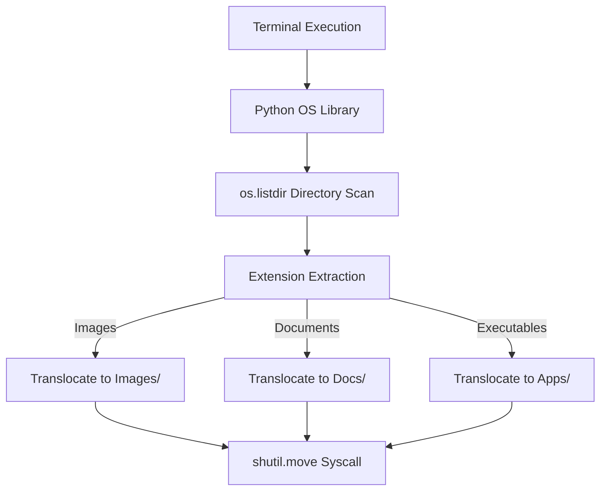

# Systems Engineering: OS File Organizer

[]()
[]()
[]()

## Overview
This repository functions as an applied Systems Engineering utility script, designed to mathematically parse, categorize, and relocate filesystem binaries based on their core extensions (e.g., `.png`, `.pdf`, `.mp4`). It serves as a practical demonstration of utilizing Python's low-level OS libraries to interface directly with the host machine's filesystem.

## Problem Statement
End-user `Downloads` and `Documents` directories frequently degrade into unstructured data swamps, costing individuals time and impacting filesystem indexing speeds. Relying on manual GUI dragging-and-dropping is unscalable. This repository solves that by deploying a localized Python automation script that programmatically intercepts the filesystem, generating structured routing directories and securely translocating files using native OS syscalls.

## Key Features
- **OS-Level Execution:** Direct integration with Python's native `os` and `shutil` modules to manipulate host memory without requiring administrative `sudo` escalation.
- **Dynamic File Classification:** Automatically parses file extensions and dynamically generates missing domain directories (e.g., creating a `Images/` folder if `.jpg` files are detected).
- **Idempotent Operations:** Designed to safely skip pre-existing directories, preventing destructive overwrites or filesystem panics during multiple executions.
- **Cross-Platform Compatibility:** Relies on standard Python OS wrappers, allowing seamless execution across MacOS, Linux, and Windows environments.

## Architecture



## Technology Stack
- **Language:** Python 3.11
- **Standard Libraries:** `os`, `shutil`
- **Testing:** `pytest` (Abstract Syntax Tree Validation)
- **Documentation:** GitHub Flavored Markdown (GFM)

## Project Structure
```text
file-organizer/
├── projects/
│   └── file_organizer/      # Core execution logic
├── tests/                   # Automated Pytest CI verification
└── README.md                # System documentation
```

## Installation
Ensure Python 3 is installed natively on your OS. No external `pip` dependencies are required.
```bash
git clone https://github.com/krsna016/file-organizer.git
cd file-organizer/projects/file_organizer
```

## Usage
Execute the script natively via the terminal within the directory you wish to organize.
```bash
python3 main.py
```

## Examples
*Example of utilizing `shutil.move` for secure file translocation:*
```python
import os
import shutil

# Securely translocate binary from Source to Destination
source_path = os.path.join(current_dir, filename)
destination_path = os.path.join(current_dir, category, filename)

shutil.move(source_path, destination_path)
```

## Screenshots
> [!NOTE]
> *Utility and OS-level repositories execute via standard terminal output without GUI interactions.*

## Visual Demonstrations
> [!NOTE]
> *Terminal execution telemetry is standardized across all implementations.*

## Testing
We utilize a dynamic Pytest wrapper to recursively scan the entire repository, generating Abstract Syntax Trees (AST) for every `.py` file. Because this script executes powerful OS-level `move` commands, proving zero syntax errors exist prior to execution is absolutely critical to prevent destructive host operations.
```bash
pytest tests/
```

## Performance Notes
- **Time Complexity:** The script operates in $O(N)$ linear time, iterating through the directory exactly once.
- **I/O Bottlenecks:** Performance is explicitly bound by the host machine's disk read/write speeds (SSD vs HDD), not the Python interpreter.

## Future Improvements
- **Argument Parsing:** Upgrade the script to utilize Python's `argparse` library, allowing developers to pass the target directory path as a CLI argument rather than relying on the Current Working Directory (CWD).
- **Dry-Run Mode:** Implement a `--dry-run` flag that prints out the intended translocation map without actually executing the `shutil.move` syscalls.

## Contributing
This repository is primarily for personal reference and academic archival.

## License
Licensed under the MIT License.
